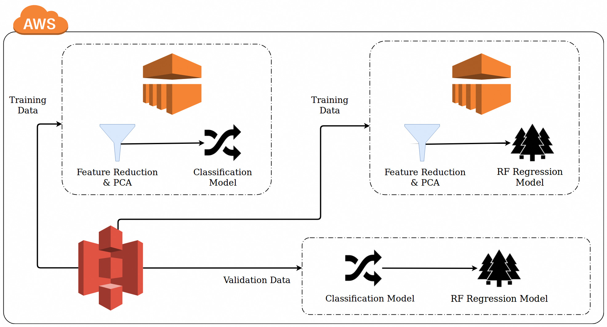
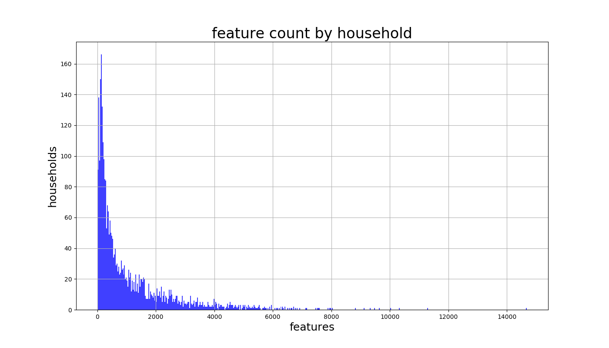
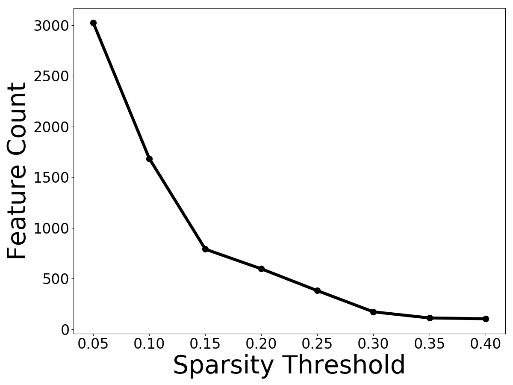
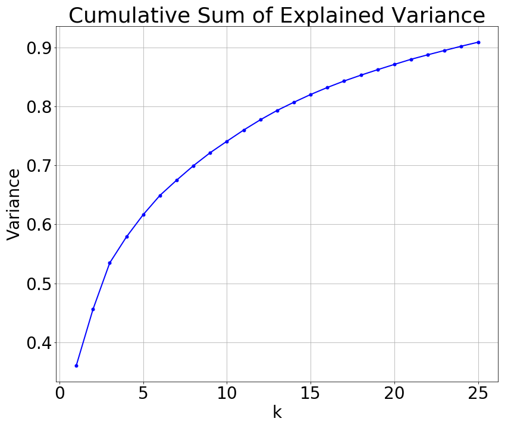

# Household Audience Builder

## Table of Contents
1. [Overview](#overview)
2. [Solution Architecture](#solution-architecture)
3. [Sparsity and Feature Reduction](#sparsity-and-feature-reduction)
4. [Model Building](#model-building)
5. [Future Directions](#future-directions)

## Overview
For my Galvanize Data Science Immersive capstone project I worked with a very large and very sparse dataset of household features to predict responsiveness to advertising. The dataset was an anonymized aggregation collected from a variety of offline, online, and mobile data sources. The goal was to predict future purchases of the target product.

To work with the dataset I built a spark application that would pipeline data from S3 into EMR clusters, perform feature reduction using PCA and SVD, and then using the best features identified, grid search for random forest classification and regression models to predict spend amount.

The dataset was provided by Oracle Data Cloud, a leading Data-as-a-Service (DaaS) provider. This project would not have been possible without their generous support and it is gratefully acknowledged.

## Solution Architecture
The solution I implemented involved stacking 2 models: the first a classification model to predict spenders vs not-spenders (of the product). The second model was a regression model to predict spend amount. The data was split into a training and a hold-out set of validation data. The training data was then pipelined to 2 AWS EMR clusters where I would grid search PCA and random forest models (the PCA was part of the grid search).

###### Figure 1. Architecture

## Sparsity and Feature Reduction
The dataset consisted of a household id, amount of target product purchased in the past, and a variable number of household features. The feature set was a list of key-value pairs of known household features. This feature set had a sparsity level of 0.8%, e.g. for every 1,000 features that should have been there, only 8 actually were. For some households I had over 10,000 features, for others, as few as 7.

###### Figure 2. How many features per household

The first step is to identify and isolate what features I want to work with. Owing to constraints in the PySpark MLLIB PCA implementation (it can only accept a maximum of 65535 features), I first had to perform a preliminary feature reduction using a sparsity cutoff threshold. That is, if an individual feature did not meet a particular existence threshold (usually .15 - .25) it would be discarded. I also included functionality to make a dummy categorical variable (present/non-present) for other existence thresholds. This sparsity cutoff would result in a feature set of approximately 500 - 3000 features that I could feed into PCA to identify a smaller subset to use in Random Forest.

###### Figure 3. Features available at various sparsity cutoff amounts

###### Figure 4. Features available at various sparsity cutoff amounts

## Model Building
I took balanced samples from the training data (non-spenders outnumbered spenders roughly 9:1) and using the features identified by PCA, I grid searched for the best random forest hyper parameters. I choose random forest because I had many features to choose from, I didn't know what features would be important, and because RF handles missing values very well. Ultimately I found that the RF hyper parameters had little effect on model accuracy compared to the features it started with. On the classification model the AUC was generally .7400 to .8350. On the classification model the best RMSE was 229. 

## Future Directions
Many parts of the application I only had time to develop quick prototypes and there are many parts I would do differently. In particular the feature selection part of the grid search shows a lot of promise and this is something I would want to develop further.

Other potential improvements:
* use Spark ML instead of MLLIB. This would have given be access to more and better models, and the ML Pipeline classes.
* use SMOTE instead of random sampling to balance classes 
* Optimize grid search parameters and Spark settings for better CPU and memory utilization.
* Test different classification and regression models, e.g. XGBoost.
* Test Singular Value Decomposition (SVD) to segment customers into groups.
* Investigate the feasibility of using a neural net autoencoder for feature extraction.

 

